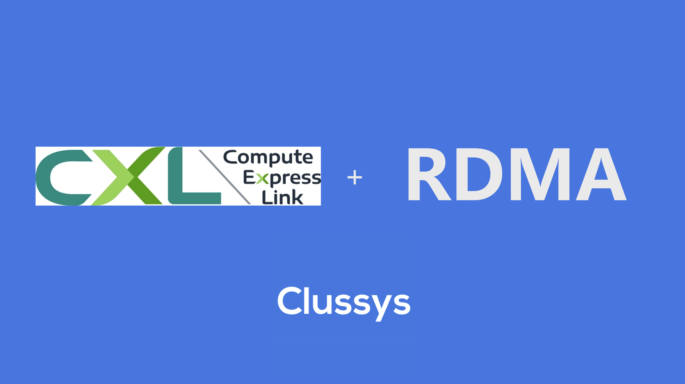
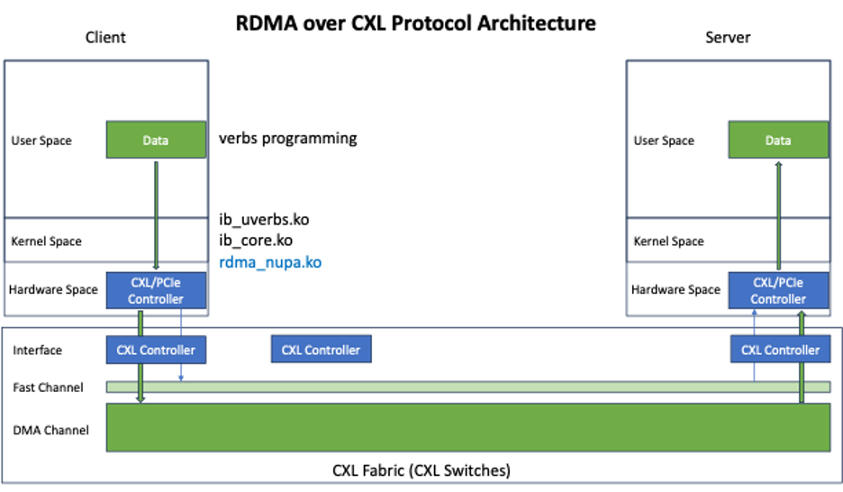
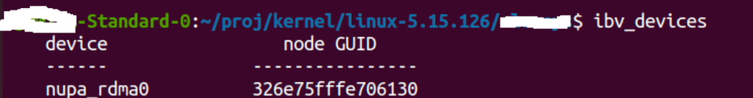
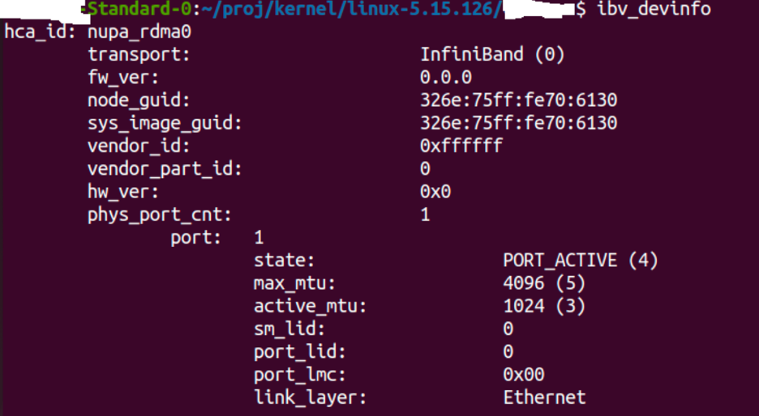
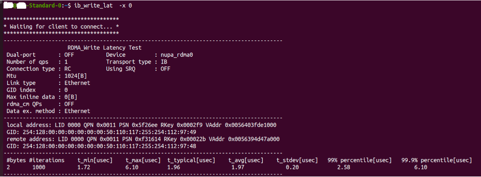
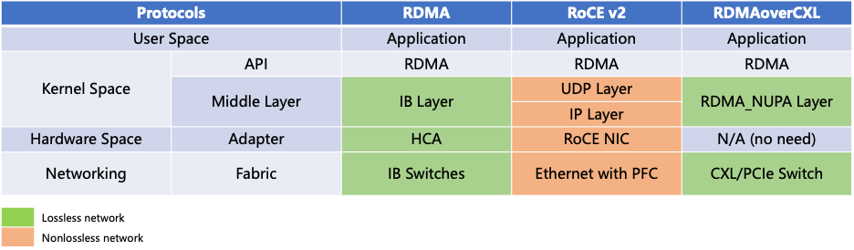

# Forward Thinking on RDMA over CXL Protocol

###### Abstract: With the rapid development of AI technology, the demand for AI networks has been increasing. In this context, Remote Direct Memory Access (RDMA) technology, which offers low latency and high throughput, has become increasingly important. However, the requirement for high-cost network interface cards (NICs) has limited the widespread adoption of traditional RDMA technology. To address this issue, this study combines the development characteristics of the future interconnect technology, Compute Express Link (CXL), with RDMA technology, resulting in the innovative RDMA over CXL protocol. This protocol achieves point-to-point transmission performance with a latency of only 1.75 microseconds, without the need for additional NICs, relying solely on CXL switches. This innovation provides a new solution for applying RDMA technology in a wider range of fields.

With the rapid advancement of large models and artificial intelligence applications, there is a growing interest in high-speed, low-latency network technologies in the industry. To enhance communication capabilities in AI computing, RDMA technology has been consistently demonstrating its advantages, becoming a crucial protocol in the field of AI network transmission and driving the latest trends in the industry.

## 1）Introduction to RDMA Technology:

RDMA (Remote Direct Memory Access) is a network communication technology that enables computer systems to directly read from and write to the memory of remote computers over a network without intermediate processing steps. This direct memory access approach is crucial in high-performance computing and data center environments. RDMA offers several advantages. Firstly, it significantly reduces data transfer latency and CPU overhead, improving system throughput and responsiveness. Secondly, RDMA enables efficient data sharing and collaboration, optimizing the performance of cluster computing and distributed storage systems. Additionally, RDMA excels in applications that deal with large-scale datasets, high-speed networks, and low-latency requirements.

Traditional implementations of RDMA require specialized network adapters and protocol stacks, such as InfiniBand Host Channel Adapters (HCAs) and RDMA over Converged Ethernet (RoCE) NICs. They utilize a Send/Receive operation model for data transfer between different computers. RDMA allows applications to initiate data transfer operations directly without CPU intervention. It's important to note that achieving RDMA functionality requires corresponding hardware and software support. RDMA finds wide applications in specific domains such as high-performance computing, big data processing, cloud computing, and virtualization. As technology advances, the importance of RDMA in network communication and data transfer will continue to grow.

## 2）Challenges with RDMA:
While RDMA offers advantages such as low latency and high bandwidth, RDMA NICs are more expensive compared to traditional network adapters. This is because RDMA NICs require complex design and manufacturing to support high-performance remote direct memory access. RDMA NICs are designed with dedicated hardware and chipsets to provide low latency, high bandwidth, and optimized data transfer efficiency, meeting the demands of performance-intensive applications. Additionally, implementing RDMA protocol stacks requires corresponding software development and support.

## 3）Clussys' Innovation: RDMA over CXL

Today, we introduced a native data transfer model based on CXL/PCIe technology and developed the RDMA protocol over CXL, bringing innovation to the field. This technology innovation allows users to leverage the benefits of RDMA over CXL without modifying existing applications.

    
    
Figure: RDMA over CXL Protocol Architecture

1) First, we built a CXL Fabric by utilizing CXL controllers. In this process, we divided the CXL memory into Fast Channels and DMA Channels to differentiate based on performance and latency requirements. The Fast Channels are used for message passing and latency-sensitive business transfers, while the DMA Channels leverage the native DMA capabilities of PCIe and CXL controllers to provide high-throughput data transfer.

2) In the kernel module, we introduced the rdma_nupa layer and created the nupa_rdma0 device, adapting RDMA operations to the CXL/PCIe controllers, seamlessly integrating with the upper layers of ib_core and ib_uverbs.

3) In the user space, applications can directly use standard RDMA verbs for programming and operations, fully utilizing the advantages of CXL/PCIe technology. This seamless integration and the use of standard interfaces simplify the work of developers and provide a convenient programming interface to leverage high-performance data transfer on the CXL Fabric.

## 4）RDMA over CXL Testbed Walkthrough

Based on this technology, we conducted tests on x86 and ARM platforms. The following is the test structure for the x86 platform.

    
    

    Figure: Building the nupa_rdma0 IB device using the rdma_nupa framework.
    

    
    

    Figure: IB device information.
    

    
    

    Figure: Latency test results using RDMA over CXL technology.
    

## 5）Comparison: RDMA over CXL vs RDMA vs RoCE v2

Similar to RoCE (RDMA over Converged Ethernet), RDMA over CXL (RoC) is a protocol innovation based on PCIe/CXL links. Through innovation at the link and protocol layers, we have successfully adapted the RDMA protocol to work over CXL networks (although standard PCIe networks can also support it). This innovation provides a new solution for implementing RDMA communication in the CXL architecture.

Unlike RoCE v2 and RDMA over InfiniBand (IB), RDMA over CXL does not require additional adapters to enable communication. It can be achieved using the standard PCIe or CXL interfaces on the CPU or GPU. Additionally, similar to IB networks, CXL networks have inherent protocol control features, providing a lossless network environment that accelerates the adoption and application of RDMA over CXL technology in practical scenarios.

    
    

Figure: We implemented RDMA over CXL by introducing the RDMA NUPA Layer.
    

## Summary: 

By combining RDMA technology with CXL, leveraging the high-speed, low-latency characteristics of CXL networks, we have successfully built the next-generation lossless network architecture and implemented the RDMA protocol for transmission. In the future, we will accelerate the adoption of this protocol in AI networks to achieve rapid commercialization of CXL network technology.

We will also provide a virtual machine demonstration environment that includes our technology and upload it to the Github website: https://github.com/Clussys

## Attachment: Introduction to CXL Technology

CXL (Compute Express Link) technology is a high-speed interconnect technology designed to improve communication efficiency between various components within a computing system. It provides a high-bandwidth, low-latency communication channel that enables direct connections between memory, accelerators, and other computing resources, significantly improving data transfer speed and overall system performance. The emergence of CXL technology brings tremendous potential for compute-intensive tasks and data-intensive applications, providing new possibilities for building the next-generation data center architecture.

The design goal of CXL technology is to provide a universal high-speed interconnect that can connect to different types of compute accelerators and devices. It is based on the physical layer and protocol of PCI Express (PCIe) but has been extended and optimized at the protocol level to meet the requirements of high-performance computing and data center applications.

CXL technology has the following key features:
1. High Bandwidth: CXL technology provides a high-bandwidth communication channel, supporting multi-channel and multi-link configurations to meet the demands of large-scale data transfer and high-speed computing.
2. Low Latency: CXL technology employs optimized communication protocols and transmission mechanisms, achieving extremely low data transfer latency, enhancing system responsiveness and real-time performance.
3. Memory Expansion: CXL technology supports Direct Memory Access (DMA), enabling compute nodes to directly access memory on remote nodes, avoiding data copying and processing overhead in traditional network communication, and improving data transfer efficiency.
4. Cooperative Acceleration: CXL technology supports efficient collaboration between compute nodes and accelerators through shared memory and cooperative acceleration, achieving higher compute performance and energy efficiency.
5. Programmability: CXL technology provides a flexible programming model and software interfaces, allowing developers to fully utilize the performance and capabilities of the CXL interface to implement customized applications and algorithm acceleration.

link as [https://www.computeexpresslink.org/about-cxl](https://www.computeexpresslink.org/about-cxl)