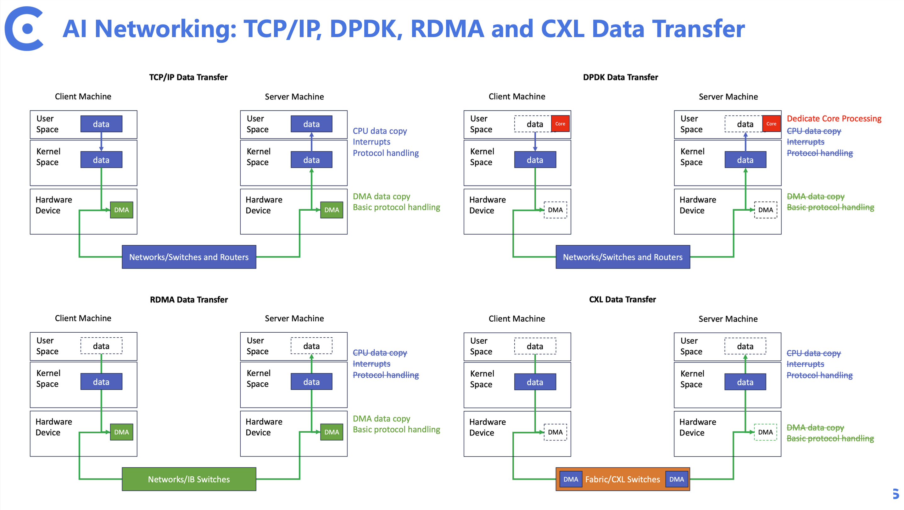

# NUPA: RDMA and TCP/IP over CXL and PCIe Fabric

###### Abstract: In the past three years, with the advancement of Large Language Models (LLMs), the potential for leveraging extensive computational power towards achieving Artificial General Intelligence (AGI) has become increasingly apparent. However, the substantial increase in model parameters has posed significant challenges to network infrastructures, especially those supporting GPU and AI cluster facilities. Nvidia, as an industry leader, has leveraged its existing GPUs and InfiniBand (IB) networks, alongside the latest NVLink and NvSwitch technologies, to develop a comprehensive solution that covers computing, networking, and storage needs. While this solution offers exceptional performance, its associated costs and closed nature necessitate a demand for new, more open, and cost-effective solutions. At Clussys, an innovative AI network infrastructure company, we are poised to build our own CXL/PCIe Fabric solution on CXL controller. Leveraging this technology, we will develop RDMA and IP protocols based on the CXL/PCIe Fabric, enabling seamless adaptation of applications to new AI networks.

As Clussys, unlike traditional Ethernet network infrastructures, we will completely abandon the MAC network model and adopt a network model based on CXL controllers. We are particularly focused on small-scale, high-performance, low-latency cluster applications. Our goal is to interconnect 100 to 1000 GPUs, CPUs, and SSDs via high-speed PCIe/CXL bus networks, allowing these computational devices to operate as if they were one single device. This is the core area of current computational performance expansion, rather than focusing on interconnecting 10,000 or even 100,000 devices as in traditional cloud computing. If needed, we can scale up using Ethernet/IB to PCIe/CXL network conversion, but this is not our primary focus currently.

In small-scale clusters, such as the Nvidia-defined superpod clusters, we are particularly concerned with high-speed, low-latency communication between devices. Just like traditional networks, the key elements for improving communication performance include hardware control as much as possible, streamlined data flow (zero copy), and excellent flow control. To simplify the model, we compare network protocols and aim to achieve data transmission by leveraging existing hardware features as much as possible.



In the figure above, we can see that traditional network card devices introduce approximately 1-3us of additional latency. Additionally, data needs to be constantly copied between user space, kernel space, and devices. While various optimization techniques and technology modules can simplify this data movement, the results are not yet satisfactory, and we need something better.

In a CXL network, data movement can directly utilize the DMA of the CXL controller without the need for additional network cards or DSPs (this also applies to PCIe networks). Furthermore, the cache protocol provided by the CXL controller allows for faster and more timely data responses between different devices. Clussys, through the design of a unique yet universal bus interconnect network that leverages the performance of CXL controllers, efficiently moves data from one CPU to another, and from one GPU to another. The end-to-end latency is only 600ns, significantly reducing latency by over three times compared to RDMA networks.

To expedite ecosystem development and gather feedback from priority engineers, we are eager to share our achievements and research progress with the broader developer community. In this repository, we will gradually unveil our advancements. The structure of this repository is as follows:

```
li@ubuntu:~/workspace/project/demo$ tree .
demo/
├── imgs
│   └── protocols.jpg
├── ip
│   ├── cxl
│   │   ├── nupanet.ko
│   │   └── README.md
│   └── pcie
│       ├── nupanet.ko
│       └── README.md
├── rdma
│   ├── cxl
│   │   ├── nupa_net.ko
│   │   ├── rdma_cxl.ko
│   │   └── README.md
│   └── pcie
│       ├── ib_uverbs.ko
│       ├── nupa_net.ko
│       ├── rdma_nupa.ko
│       └── README.md
├── README.md
├── uec
│   └── README.md
└── vms
    ├── cxl
    │   ├── node1.sh
    │   ├── node2.sh
    │   └── README.md
    └── pcie
        ├── node1.sh
        ├── node2.sh
        └── README.md

```

To accelerate ecosystem development and incorporate the opinions and suggestions of priority engineers, we are eager to share our achievements and R&D progress with developers. In this repository, we will gradually open up our progress. The structure of this repository is as follows:

### IP Folder
In the `ip` folder, we will build netdevice devices on the CXL network and introduce the capability of DMA technology for data transmission. Given the characteristics of CXL and PCIe networks, we aim to simplify protocol processing in the netdevice flow, removing unnecessary verification and inspection processes. We will provide applications for both CXL and PCIe scenarios.

### RDMA Folder
In the `rdma` folder, we will directly build RDMA devices on the CXL network and re-adapt the verbs interface. This is to enable applications to adapt to the future arrival of CXL networks without the need for modifications. Similarly, we will offer both CXL and PCIe modes.

### UEC Folder
UEC? This is for the future, but since the future has not arrived yet, let's reserve a spot for UEC.

```
         -----------------------------------------------
        |       |          |  Latency     |  Cloud      |
 App    |  HPC  |  LLM     |  Senstive    |  Native     |
        |  APP  |  APP     |  APP         |  APP        |
         ------------------------------------------------
        |                         |                     |
Protocol|    RDMA       ----------     TCP/UDP/IP       |
        |              |                                |
         ------------------------------------------------
        |              |                                |
 HW     |     IB       |              MAC               |
        |              |                                |
         -----------------------------------------------
               Current Application and Networking

```
with the help of UEC, the community aiming to do like this:

```
         -----------------------------------------------
        |       |          |  Latency     |  Cloud      |
  App   |  HPC  |  LLM     |  Senstive    |  Native     |
        |  APP  |  APP     |  APP         |  APP        |
         ------------------------------------------------
        |             |              |                  |
Protocl |    RDMA     |     UEC      |    TCP/UDP/IP    |
        |             |              |                  |
         ------------------------------------------------
        |         |   PCIe    |                         |
 HW     |     IB  |   CXL     |          MAC            |
        |         |   UCIe    |                         |
         -----------------------------------------------
                       ^                       
                     Clussys

      The future of UEC Networking, with where Clussys sits

```
However UEC is still in its very early stage. Clussys will keep a close eye on its development.


### VMS Folder
Finally, our main attraction, the `vms` folder, our software development environment. As the name suggests, this is a development and verification environment based on virtual machines. Of course, in virtual machines, performance expectations should be moderated. The goal is to demonstrate the credibility of the technology. Within the `vms` directory, we have built two environments for CXL and PCIe. It is worth mentioning that CXL is a rapidly evolving technology with high kernel requirements. Therefore, we have selected the 6.3 kernel series. While new kernels offer new features, stability needs collective validation. For PCIe, a long-standing technology, we have opted for the 5.15 kernel. In each virtual machine environment, you can run scprits for usage and experience. Additionally, a `readme` file is available for reference.

Finally, we gave our architecture a name, NUPA :-)

The project will be hosted on GitHub, accessible at https://github.com/Clussys/nupa. For those interested in a test binary file, please direct your inquiries to info@clussys.com.

### Github repo

 [https://github.com/Clussys/nupa](https://github.com/Clussys/nupa)
