# Towards Tomorrow's AI Networking: RDMA and TCP/IP over CXL Fabric and More
By Dr. Fu Li, CTO of Clussys Inc.

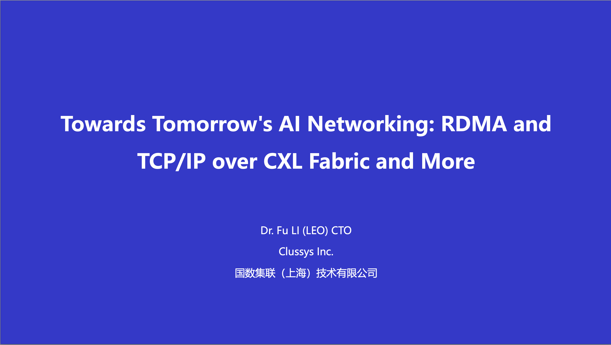

Hello everyone, Today, we will share our insights on how our company views AI networking and the advancements we are making with CXL technology. We have titled our presentation "RDMA and TCP/IP over CXL Fabric and More." We will discuss the progress of the RDMA and TCP/IP protocols over CXL fabrics and their applications in high-performance GPU clusters and high-performance storage clusters in the field of artificial intelligence.

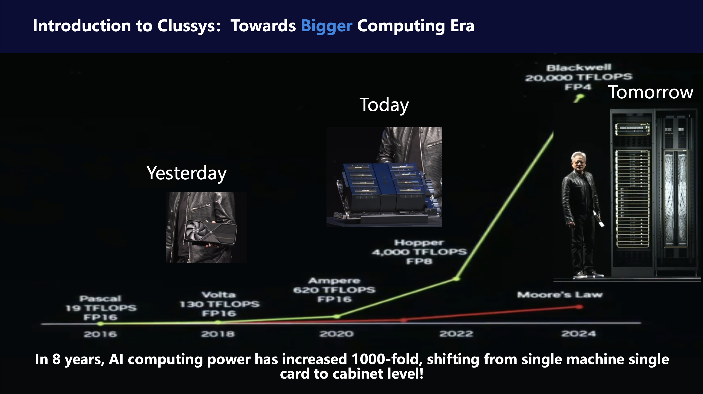

First, let's introduce the current trends in the computing field. Over the past eight years, computing power has increased by 1,000 times. This is an astonishing improvement, far exceeding the predictions of Moore's Law in the general computing field. The main driver behind this incredible advancement is NVIDIA, which has achieved both technical and commercial success. However, if we think carefully about the driving force behind this remarkable improvement, it is the transformation of computing architectures.

As shown in our image, in 2018, when we talked about computing power, it was represented by a single GPU card, a device that could be held in one hand, just like what Jensen Huang demonstrated. However, by around 2020, Jensen Huang changed the handheld device to a large GPU, an 8-GPU matrix fully connected by NVLink, which he pulled out of an oven. Today, Jensen Huang can no longer hold the most powerful GPU in his hands because the definition of the most powerful GPU has evolved into a 36-GPU or 72-GPU cabinet fully connected by NVLink. As Jensen Huang summarized, we need bigger and stronger GPUs! Parallel computing architectures have thus evolved from intra-chip parallelism (with multiple CUDA cores) to ultra-multi-core computing modules based on new NVLink connections. 

We call this transformation in computing the "Bigger Computing Era." The core driving this era of transformation is the super-fast and super-efficient new interconnect systems.

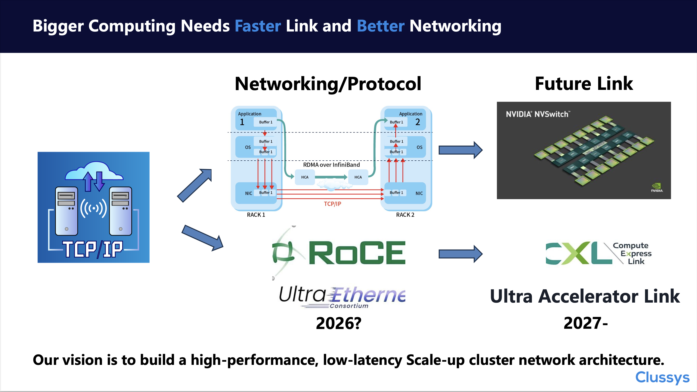

Big computing requires faster connections and better network protocols. 

Let's revisit the familiar TCP/IP protocol, which was designed and refined in the 1970s to address issues like scalability and stability in wide-area network communications. Today, however, in the field of artificial intelligence, we face short-distance interconnect challenges. In data centers, we rarely change the positions of servers, and due to the stable environment provided by data centers, our physical connections are relatively stable as well. Our needs have shifted from delivering information to a billion users over a wide-area network to interconnecting 10,000 GPUs or even 100,000 GPUs at high speeds. Although 100,000 GPUs sound like a lot, it is a small number compared to enterprises in the wide-area network field with billions of users. In fact, many AI companies face the practical problem of "how to efficiently and quickly interconnect clusters of thousands of GPUs." Given that NVIDIA currently uses 8 GPUs as a unit of computation, this only requires interconnecting 125 servers. If we consider the current "big computing" model with 72 GPUs as a unit, we only need to connect 15 cabinets. When we say "only," we don't mean that this connection is simple, but rather that the network demand has shifted from billions of connections to thousands of high-speed connections.

NVIDIA recognized this transformation early on. After acquiring RDMA and IB protocols, they developed their unique NVLink technology based on PCIe, using NVLink + IB to build large-scale computing systems. NVLink handles scale-up, while IB handles scale-out. Although the industry proposed the RoCE solution early on to build a more open system and compete with NVIDIA's RDMA/IB technology, it lagged behind NVLink in the scale-up interconnect domain by several steps.
Recently, the concept of UALINK directly targets NVIDIA's NVLink core area. However, the long process of protocol standardization makes UALINK's future uncertain, bringing many uncertainties to GPU manufacturers. CXL, as a transitional or integrative technology between PCIe and UALINK, offers us a practical solution for the present and near future.

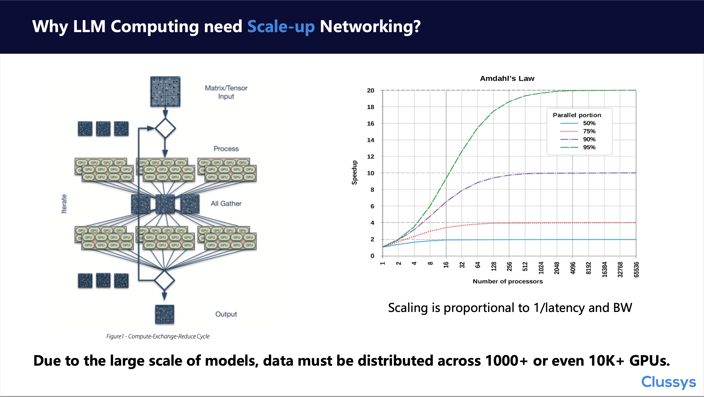

Before we discuss how to leverage CXL technology, let's first review why large language models (LLMs) require scale-up networks. Simply put, LLMs are based on a computational theory that emphasizes the power of large-scale computation—using vast amounts of data and model parameters to predict human thought. While a large amount of data can be processed linearly and in partitions, the computation of model parameters, which involves two-dimensional matrices, requires a "scatter-gather-scatter" computational framework.

In the realm of large models, there exists a Scaling Law, which essentially means "more computation yields better results." Similarly, in distributed computing architectures, there is also a Scaling Law: the proportion of serial computation directly determines the acceleration performance of the distributed system, and data transfer and synchronization are typical examples of serial computation. Therefore, the exchange of parameters between GPUs is a critical factor limiting the current large-scale GPU computation. We must address both the startup time (latency) and the transmission volume (throughput) of GPU-to-GPU communication.
Next, let's explore how to solve these two problems.

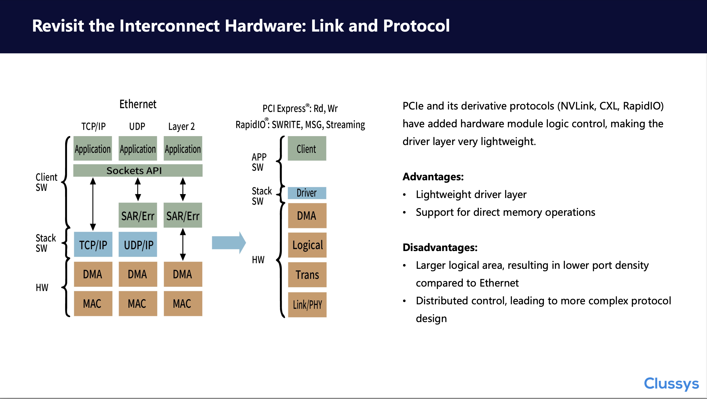

Let's first look at the hardware architecture of interconnects. Currently, interconnects are primarily developed based on SerDes technology. Today, we won't discuss which SerDes technology is better but will focus on Ethernet transmission protocols and the PCIe bus and its derivatives or similar technologies based on SerDes technology. 

Before we delve into a detailed analysis of the Ethernet and PCIe technology as interconnect technologies for AI networking, we first provide the conclusion: NVIDIA's NVLINK, Intel's proposed CXL, and the future UALink are all developed based on PCIe technology. In other words, discussing whether Ethernet is suitable for scale-up networks is essentially a meaningless question, which is also our viewpoint in previous analysis articles about the CXL and Ethernet debate. Today, we should focus more on the following two questions:

1. Why do people choose PCIe instead of Ethernet?

The difference in hardware controller design. PCIe or bus technology is a strongly consistent technology that requires data to be "mission-critical." High-speed data transmission can be achieved through an MMU unit on a master chip (CPU or MCU). This requires the PCIe controller itself to have basic data transmission protocol control capabilities or basic flow control logic. Ethernet is a very weak interconnect design because Ethernet hardware does not involve transmission reliability. The design philosophy of Ethernet is to delegate the reliability of data transmission to upper-layer protocols, namely connection-oriented TCP protocols or connectionless UDP protocols.

Due to these design differences, the physical logic of Ethernet is relatively simple and occupies less area, while PCIe has a larger area and requires more "coastline." However, if we consider the logic of the control protocol unit in Ethernet, the consumed logic of Ethernet is actually not much different from PCIe.

Due to the difference in hardware design, PCIe system IO operations require significantly fewer resources at the system level compared to Ethernet, making it a thinner stack layer.
In summary, to achieve the same control capabilities, the costs are actually similar. Acceleration computing cores like CUDA, which consist of numerous small computing units, cannot bear the burden of large-scale data traffic processing. Therefore, NVLINK and UALINK based on PCIe technology have become the main choice paths.

2. Why don't people directly use PCIe technology?

This question was actually answered when NVIDIA first introduced NVLINK technology. PCIe is developing too slowly. Although PCIe technology has excellent compatibility, outstanding performance, and simple programmability, the problem also lies here. Due to the requirement for compatibility, the historical burden of the PCIe protocol is very heavy. Additionally, as a transmission protocol between the CPU and devices, PCIe needs to accommodate the diversity of various devices' IO operations, including synchronous, asynchronous, and granularity requirements. According to the bucket theory, this support for heterogeneous computing systems leads to the PCIe original design being very strict and high-standard, therefore more complicated.

In the AI large model industry, what we need to achieve is high-speed communication between GPUs, with a relatively single computing system. The main purpose of GPU-to-GPU communication is to quickly transfer large-scale parameters in bulk. This transfer is generally strongly bound to the computation algorithm. Therefore, NVLink chose to retain part of the PCIe foundation while simplifying PCIe controller design principles, transforming into the NVLINK controller. This transformation is worth learning from for UALINK and CXL, which gives birth to one more question as below.

3. How to design a private or general protocol based on PCIe?

Based on the above analysis of NVLINK and PCIe, we can see that the future network architecture based on the PCIe protocol will retain the bus design principles of PCIe but will simplify or enhance the controller according to the computing scenario to achieve higher, faster, and stronger Olympic standards. We will provide a design scheme based on CXL, and of course, we welcome everyone to cooperate with us to customize their own networking computing protocols.

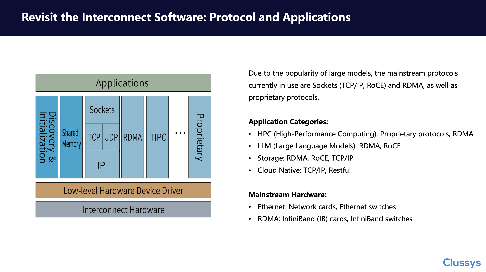

After discussing the hardware architecture and development trends of interconnects, we will now analyze software protocols. Unlike hardware controllers, which are essentially unchangeable once designed, software protocols develop very quickly and are highly variable. When discussing software protocols, we must consider their integration with application software. We can broadly categorize application software into four categories: 1) the crown jewel HPC, 2) the industry buzz world LLM, 3) storage, and 4) cloud-native.

HPC, often regarded as the Oscars of the computing field, typically develops its own unique communication protocols. However, in recent years, due to the outstanding computational power of GPUs and budget constraints, RDMA and IB solutions dominate the top ten rankings. Performance-wise, proprietary protocols still lead, but cost-wise, RoCE is more favorable.

Today's focus is on 2) the industry hotspot LLM, which stands as a special case between HPC and general computing. While it demands the same performance as the HPC industry, it does not have the diverse application scenarios of general computing. Therefore, RDMA protocols tailored to the development of LLM algorithms have become a stable and reliable solution. Particularly with the addition of NVLINK, it significantly reduces the need for RDMA network scaling. This combination of IB and NVLINK provides larger network scalability, addressing the long-standing scale-out issues of RDMA. Categories 3) and 4) are not the focus today and can be briefly mentioned.

Regarding hardware, we have Ethernet NICs and RDMA NICs (or IB NICs). RoCE, as an overlay technology, if implemented with hardware acceleration, would have a cost similar to that of IB NICs. This explains why RoCE, despite many years of development, has not ultimately replaced IB in the high-performance domain.

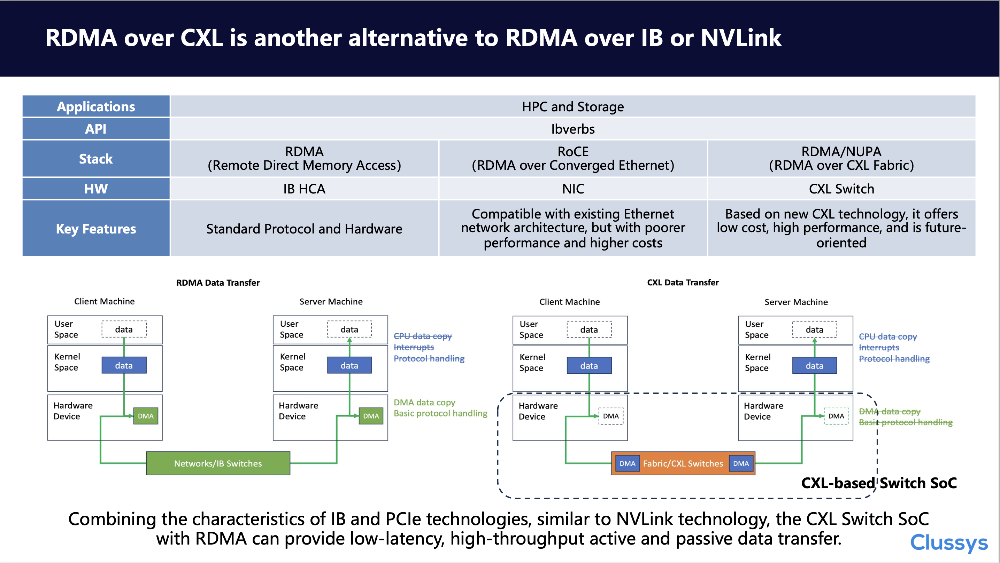

Are there any other solutions? We consider RDMA over CXL a viable solution. Since GPUs are relatively closed systems and there is currently no non-NVLINK NVSWITCH solution, we will compare native RDMA (i.e., IB), RoCE, and our RDMA over CXL in the context of HPC and storage applications. Unlike IB and RoCE, we do not need network adapters; we can achieve efficient data migration by leveraging the built-in DMA and IO engines of CXL or PCIe. Compared to native RDMA, we have "moved" or "integrated" the functions of the IB card into the CXL switch chip, resulting in a low-latency, high-throughput solution. Let's emphasize again, with CXL based Switch SoC, no adapters are needed!

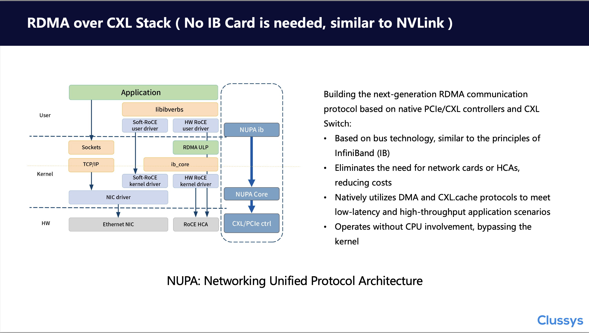

At the software driver layer, similar to the initial IB protocol, we build a unified memory communication model. We call this the NUPA architecture, which stands for Networking Unified Protocol Architecture. The design philosophy of NUPA is very similar to that of IB from the 1990s, except that we base it on PCIe technology rather than the PCI technology of the last century. If the CXL.cache protocol is supported, we can even provide ultra-low latency cache queues, achieving both low latency and high throughput simultaneously. Of course, utilizing PCIe's DMA to achieve CPU bypass is a fundamental feature of this technology, but we won't delve into that here.

To facilitate customer programming and adapt to user programming environments, we build the NUPA ibdevice on top of the NUPA Core. By modifying and optimizing the underlying ibdevice, we ensure that customers do not need to worry about changes in the underlying link. Additionally, we provide netdev to achieve compatibility with cloud-native applications.

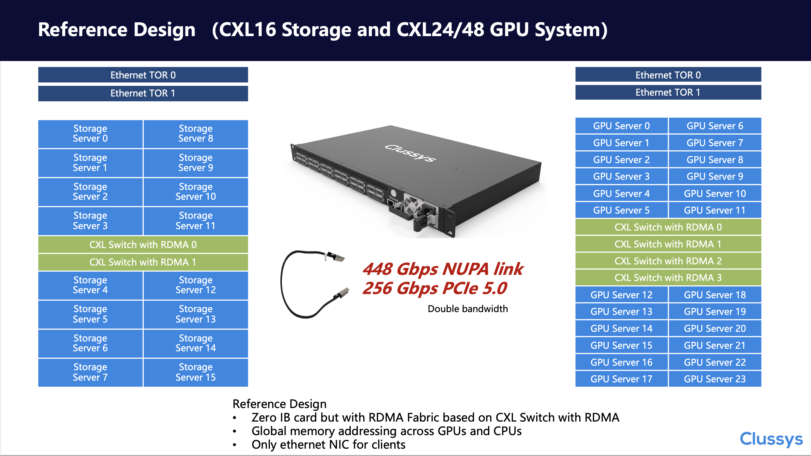

Combining this knowledge, we have launched our first system. Through the ASM interface, we will provide 24 native PCIe Gen5.0x4 lanes at 256Gbps each. If our customized protocol is used, performance can reach up to 448Gbps. By leveraging switch stacking, we can achieve RDMA communication within a cabinet without any IB NICs, providing a network solution for distributed storage and GPU clusters.

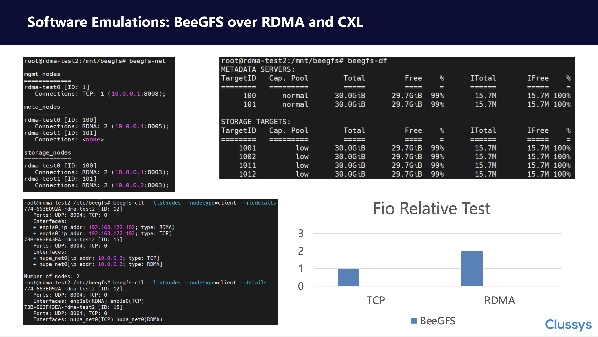

Based on our software protocol and the latest QEMU environment, we can build a BeeGFS system based on our RDMA protocol. We use the simplest mode to construct the BeeGFS cluster. By comparing the TCP protocol and the RDMA protocol, we found that the RDMA protocol can indeed accelerate system performance. Of course, since this is a software simulation environment, we only provide relative figures. These relative figures offer a reference for solutions based on CXL unified memory communication.

We emphasize once again that the core advantage of networking based on CXL and PCIe technology is "no more adapters"! This provides significant advantages in both performance enhancement and cost reduction, like NVLINK. Our simulation environment and protocol development bridge the gap between this advantageous architecture and the customer's actual application environment, which is the RDMA protocol!

Finally, let's return to PCIe, CXL, NVLink, and the previously mentioned UALINK technology. Although UALINK is currently at a very early stage, its proposal indeed gives the industry hope to counter NVIDIA's NVLINK. While this hope should have come earlier, it's better late than never.

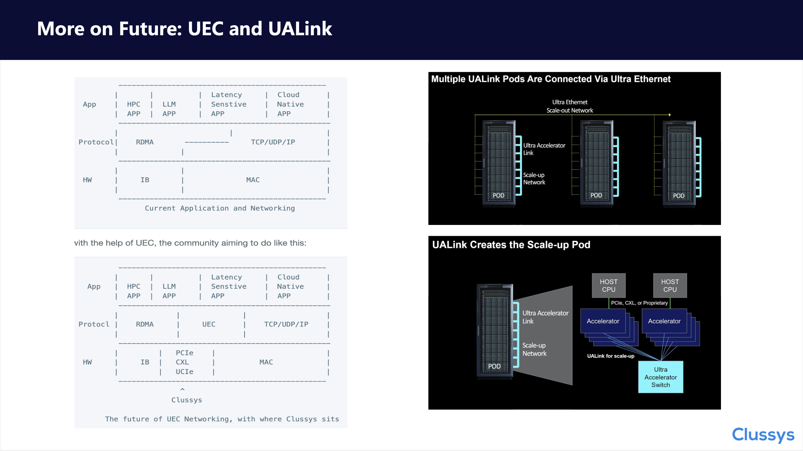

Combining our years of technical research and experience accumulation, we position Clussys between IB and Ethernet MAC. We hope to build a new controller through PCIe, CXL, UCIe, and the future UALINK, or a controller compatible with both Ethernet Serdes and PCIe Serdes, to implement modern RDMA protocols, or perhaps UEC?

Finally, thank you all for listening. We welcome everyone to follow our official WeChat account.

