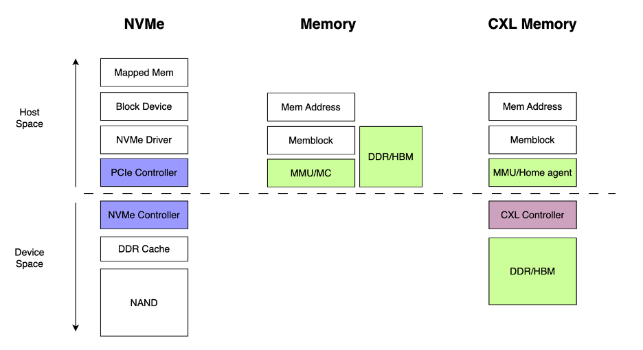
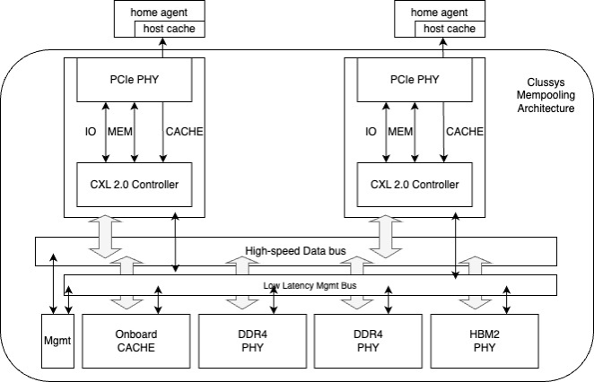

# Clussys’s Solution to Memory Expansion

## 1. Introduction: The Necessity for Memory Expansion

In the evolving landscape of cloud computing and AI, we're encountering a crucial need for memory expansion, driven by two pivotal trends:

Firstly, the prevalent issue of resource over-commitment in cloud computing has led to a hardware innovation known as memory pooling. This technique, by allocating from a shared memory pool, effectively mitigates the impact of instability and variability in client-host memory requirements. Such aggregation and allocation of memory resources not only enhance the efficiency of resource utilization but also significantly reduce the overall system cost.

Secondly, with the rapid development of Large Language Models (LLMs), the number of model parameters has been steadily climbing. These extensive parameter sets require larger memory capacities for swift processing. Traditional CPUs and GPUs, using parallel memory designs, struggle to match the expanding speed of model parameters, limiting the performance of language models. Conversely, memory architectures adopting serial design solutions like PCIe and High Bandwidth Memory (HBM) have greatly improved performance. With chip integration and near-neighbor connection technologies (such as chip stacking, system packaging, multi-chip modules), HBM is anticipated to dominate the future trend of large-capacity memory technology. Meanwhile, memory expansion solutions are gradually adopting PCIe extension methods, highlighting the role of our CXL protocol.

In practice, memory expansion driven by these two needs shows subtle differences. In memory pooling applications, reducing costs, dynamic memory management, and ensuring memory isolation are key considerations, with less focus on latency. In contrast, in LLM computing scenarios, sensitivity to memory response latency and data throughput is much higher, demanding more urgent performance optimization.

CXL technology, with its low latency, high bandwidth interconnect features, and support for cross-device memory consistency, perfectly meets these needs in both memory pooling and LLM computing domains. Memory expansion solutions implemented through the CXL protocol can integrate and maximize memory resources in the above scenarios, providing robust performance support for various compute-intensive tasks.

## 2. Clussys’ Deep Thinking: What is Memory?
While mainstream chip companies view memory expansion from a business needs perspective, we must delve into the underlying reasons behind these needs and technological developments, enabling architects to design and optimize systems at a systemic level and guide application software.

Before understanding the rationale behind memory pooling, we should consider the following questions:

#### 1)	Why is memory pooling more complex, while its counterpart, storage pooling, has already been achieved through network disks, especially with the performance of remote disks significantly improved by NVMe-oF and RDMA technologies, narrowing the gap with local disks?

#### 2)	Why can't large models run on disks? Strictly speaking, the capacity of NVMe SSDs is sufficient for current large model parameters. So, what are the connections and differences between CXL and NVMe controllers?

#### 3)	Without CXL, can't we achieve memory pooling? Can't we use PCIe, or will UCIe be used in the future?
 

To answer these questions, we need to understand the difference between memory and storage and how they are driven in the Linux kernel. Taking modern storage technology NVMe as an example, it exists as a PCIe device in standard Linux systems. After kernel boot-up, devices are discovered by scanning the PCIe device tree to find basic information (like PCI info), followed by loading the appropriate drivers, such as NVMe, and recognizing them as block devices. Block devices define modules related to input and output, like bio. System utilization of NVMe devices is achieved through a combination of bio and NVMe/PCIe input/output operations. Hence, NVMe devices are essentially block device abstractions of PCIe devices. The system interacts through block device objects, with underlying I/O and DMA technologies aimed at reducing latency and increasing device throughput.

However, what kind of device is memory in the system? Is it a block, character, or network device? The answer is none of these. In Linux systems, memory is a continuous address space, with I/O operations conducted through the Memory Management Unit (MMU), address space mapping handled by memory block page tables, and Translation Lookaside Buffer (TLB) managing hot pages.

Understanding these differences helps comprehend the role of CXL Memory. It acts as MMU and MC through the Home Agent module, facilitating kernel system initialization and establishing Memblock page tables. Concurrently, the MC connects to the PCIe slot through the CXL Controller. To achieve this, various system components are involved: Bios sets the address type of the CXL Home Agent to memory type, and with the CXL Controller plugged into the PCIe slot, the system needs to initialize this part beforehand. When adding physical memory modules, space originally belonging to PCIe slots should be loaded in advance. Thus, when using the Home Agent as a memory function, system initialization requires collaboration between Bios and the CXL Controller. Otherwise, the system might be identified as a memory device and used according to block device drivers.

Then, why not use CXL Memory as a block device? The answer is obvious but seldom pondered upon. The stack of a block device is overly complex, involving various queues and system calls, significantly increasing system latency, approximately in the range of 1 to 5 microseconds. Our goal is to reach memory device performance at the 200-nanosecond level, a tenfold improvement. Although the current gap is less than fivefold, the technological trend aims for a tenfold enhancement, necessitating ongoing optimization.

If a CPU does not support the CXL Controller, for instance, older CPUs lacking this feature, how can it be used? However, ingenious solutions always exist. As far as I know, some companies have driven CXL Memory as a native Ramdisk, then used this Ramdisk to build Swap space. Yes, virtual memory pages, expanding user-perceived "sufficient" memory through increased virtual page swapping. Most background-running programs can afford to be slightly slower, especially when combined with page compression technology (like zram). In computer architecture, trading time for space is a common practice. However, this approach is obviously not friendly for large models, as enabling large model programs to actively handle page swapping requires highly advanced technical and artistic skills, a feat few can achieve.

Thus, the core issue with expanding memory through PCIe slots (including CXL slots) is "how to define this memory." In Linux's original design, it might not have anticipated the rapid development of the phenomenon that "memory does not equal address" or that "memory modules need redesigning". Indeed, this trend became apparent when Apple introduced hardware memory compression in 2019. Unfortunately, the Linux community did not respond promptly to this trend, only improving software-level page compression. Naturally, Linux is a software community, so this state is to be expected.

With this understanding, let's revisit the questions:

#### 1)	Memory has not yet achieved pooling because the software is not ready, and expansion can only be achieved through hardware controllers, with CXL as an emerging protocol just beginning to be accepted.

#### 2)	Large models can run on disks, but managing the interaction between memory pages and virtual pages requires high technical and artistic skills. In an era where manufacturers are stacking materials to "save money," this approach is niche or for those on a budget.

#### 3)	Without CXL, memory pooling is still achievable with only PCIe, but due to unready software, it can only exist as a virtual page method, a technology route for publishing papers. In the future, UCIe might completely sever the connection between MC and UCIe controller or appear in a multimodal form.

Today, we are finally beginning to ponder the essence of memory, a rhythm that will thoroughly transform the field of computing.
3.	Clussys’ Hardware Design: Memory Pipeline
In this article, we focus on hardware design and performance testing. We will dedicate a separate article to the topic of memory deviceization in software space. Having understood the drivers for memory expansion needs and innovation, as well as potential innovative approaches, we will follow the mainstream serial development direction in system design, fully considering performance scalability. We aim to enhance latency performance by constructing different channels based on memory characteristics, and significantly increase data throughput using DMA.

The guiding principles for system architecture design are as follows:

#### 1)	Separation of data plane and control plane, and support for various types of memory.
We will categorize expanded memory into three main modules: cache, RAM (DDR), and high bandwidth memory (HBM), achieving separation of control and data planes. Considering the differences in latency and capacity between cache, memory, and HBM, we will use cache as a high-performance channel, while memory and HBM will work in conjunction with DMA to provide robust data throughput.

#### 2)	Support for multiple RCs (Root Complexes) in preparation for memory reuse and CXL Switch support.
While single RC memory expansion is a requirement, we consider support for multiple RCs from the design outset, compatible with future CXL Switches and multi-host memory reuse.

Ultimately, these design principles are integrated to form the following system architecture:

 

## Test Results:

With the support of CXL 2.0 Controller and FPGA, combined with the efforts of engineers, we achieved the following results:
 
A 350ns latency in the cache channel, and around 600ns for DDR and HBM. The next step will be to continue optimizing the bus structure, with an anticipated latency reduction of another 100-200ns.

# 4. The End

Memory expansion, as an emerging frontier technology, combined with the characteristics and application scenarios of CXL, is reshaping the as-yet un-deconstructed memory modules in computer architecture. By deconstructing memory modules, we are not only redefining computer bus architecture but also profoundly impacting network topology and protocols. For instance, the GPU large memory system built using CXL-based technology exemplifies this trend and practice. In an era of rapid transformation in computer architecture, we focus on shifts in cost, performance, and application scenarios, moving from small to massive computing, truly democratizing supercomputing. In memory expansion and network protocols, we will contribute to this field.

The project will be hosted on GitHub, accessible at https://github.com/Clussys/fpga-cxl-showcase. For those interested in a test binary file, please direct your inquiries to info@clussys.com.